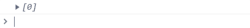

Every second, the counter increments by one. The counter is then added to the beginning of an array. The array is “truncated” so that it never becomes longer than 9.

The array is logged to the console.
